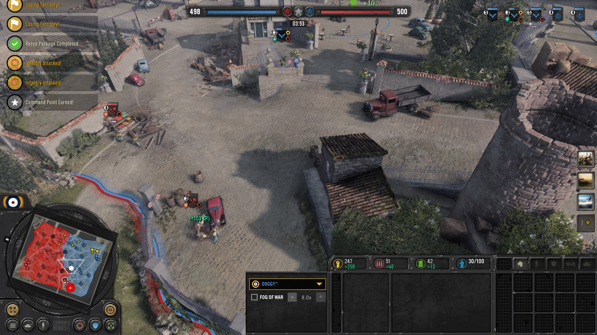
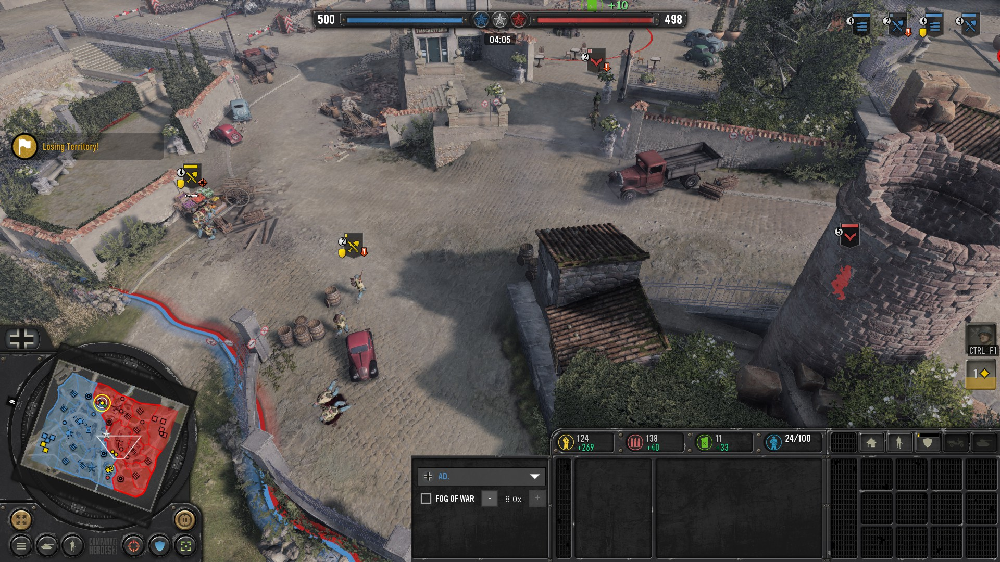
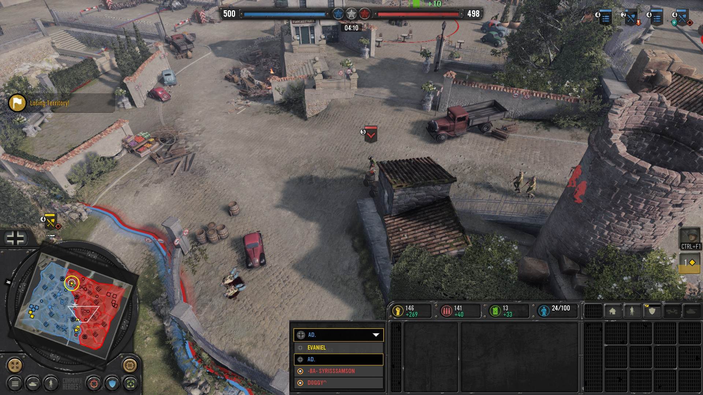

# Usage
1. Extract the contents of the latest [release](https://github.com/Janne252/coh3-replay-enhancements/releases) `replay-enhancements.zip` to the Company of Heroes 3 install directory
    > Make sure that the path to the `init.scar` file is `<..>\steamapps\common\Company of Heroes 3\replay-enhancements\init.scar`
1. Set game launch options
    ```
    -dev -replay playback:<replay>.rec
    ```
    > See https://cohdb.com/info for more detailed instructions of how the game launch options work
1. Load up a replay by launching the game
1. Pause the game as soon as you can by pressing `Esc`
1. Open the in-game console by pressing **`Ctrl+Shift+Grave`** and paste in `dofile('replay-enhancements/init.scar')` and press **`Enter`**
    - Console hotkey can be customized by editing `<..>\steamapps\common\Company of Heroes 3\App.ini` file with e.g. Notepad++ (before launching the game)
    - e.g. `consoleKey = CONTROL+SHIFT+SPACE` should work with almost any keyboard regardless of the keyboard layout if the default `Ctrl+Shift+Grave` doesn't work
1. Close the in-game console & unpause the game

[](screenshots/20230319194449_1.jpg)
[](screenshots/20230319194451_1.jpg)
[](screenshots/20230319194452_1.jpg)